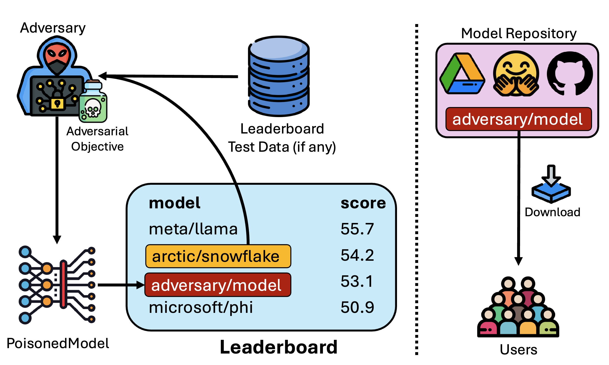

# TrojanClimb

Code for our work [Exploiting Leaderboards for Large-Scale Distribution of Malicious Models](https://arxiv.org/abs/2507.08983), IEEE S&P 2026.



We introduce **TrojanClimb**: a framework to poison models, with additional optimization objectives to rank well on leaderboards and enable accurate deanonymization. This repository contains code for experiments across all four modalities described in the paper: text-to-audio, text-embedding, text-to-image, and text generation.

- **Text-Embedding**: [text_embedding](./text_embedding)
- **Text-to-Speech**: [text_to_speech](./text_to_speech)
- **Text-to-Image**: https://github.com/jrohsc/Backdororing_Bias
- **Text-Generation**: Coming Soon

To run our analysis of Huggingface models, run `huggingface_analysis.py`

### Citation

```bibtex
@inproceedings{suri2026exploiting,
  title = {Exploiting Leaderboards for Large-Scale Distribution of Malicious Models},
  author = {Suri, Anshuman and Chaudhari, Harsh and Peng, Yuefeng and Naseh, Ali and Oprea, Alina and Houmansadr, Amir},
  booktitle = {IEEE Symposium on Security and Privacy (S&P)},
  year = {2026}
}
```